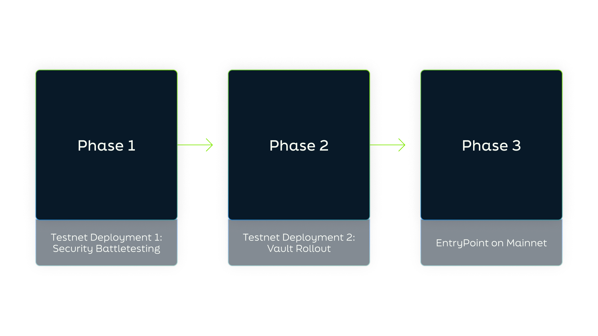

- [1. The Status Quo](#1-the-status-quo)
- [2. EntryPoint](#2-entrypoint)
  - [2.1 Non-Custodial Index Vaults](#21-non-custodial-index-vaults)
  - [2.2 Vault Examples](#22-vaultexamples)
  - [2.3 Fully Collateralised Index Tokens](#23-fully-collateralised-index-tokens)
  - [2.4 Use Cases](#24-use-cases)
  - [2.5 Revenue Model](#25-revenue-model)
- [3. EntryPoint Infrastructure](#3-entrypoint-infrastructure)
  - [3.1 Authority Module](#31-authority-module)
  - [3.2 Data Module](#32-data-module)
  - [3.3 Trading Module](#33-trading-module)
  - [3.4 Vaults Module](#34-vaults-module)
  - [3.5 Securing EntryPoint](#35-securing-entrypoint)
- [4. EntryPoint and the CosmosHub - A Strategic Alliance](#4-entrypoint-and-the-cosmoshub---a-strategic-alliance)
- [5. Governance and Risk Mitigation](#5-governance-and-risk-mitigation)
  - [5.1 Standard Governance](#51-standard-governance)
  - [5.2 Representatives](#52-representatives)
  - [5.3 Technical Committee](#53-technical-committee)
  - [5.4 Index Vaults and Risk Management](#54-index-vaults-and-risk-management)
  - [5.5 Regulatory Strategy](#55-regulatory-strategy)
- [6. Delivery](#6-delivery)

**DISCLAIMER**
*This whitepaper does not constitute investment advice, does not include any promises, offers, guarantees, representations or warranties, and includes speculative forward-looking statements about potential post-launch capabilities of EntryPoint. This whitepaper is qualified in its entirety by the project disclaimers.*

## 1. The Status Quo

The evolution of financial markets has been significantly influenced by the advent of index funds, which have revolutionised investing by offering a diversified portfolio through a single investment vehicle. This innovation has streamlined the investment process and democratised market access, enabling individual investors to participate in a broad spectrum of assets with reduced risk and enhanced convenience. Over time, traditional finance (TradFi) has refined these offerings, embedding rigorous risk management and professional best practices into their structures, reflecting a mature investment culture that prioritises reliability and stability. However, the reliance on centralised systems within TradFi introduces notable inefficiencies. Lengthy settlement times, lack of transparency, and the necessity for intermediary supervision collectively impose considerable costs, limit investor access and control, and introduce potential points of failure into the supply chain. Often, these inefficiencies compromise the natural flow and dynamism of markets, hindering optimal interaction.

The tokenisation of financial assets through blockchain technology has emerged as a transformative solution to these legacy challenges, materialising in the nascent but rapidly evolving sector of decentralised finance (DeFi). By enabling faster settlements, transparent transaction ledgers, and a degree of composability previously unattainable, DeFi is poised to reconstruct financial services beyond traditional confines, fostering a more accessible and fluid ecosystem without central intermediaries. Despite its promise, the current state of DeFi is marked by complexity and unpredictability. While it offers a break from the constraints of TradFi, it also presents a daunting array of choices and risks; be it tokens, wallets, blockchain ecosystems, or inconsistent protocol security. This complexity not only hampers user experience but also signals a gap in the market to replicate the success of passive index strategies, which offer a more straightforward path to portfolio diversification and sound risk management. 

For professional index providers looking to upgrade their business model, scale on-chain tokenisation and accelerate go-to-market efforts, the challenge remains in finding a decentralised platform that can support a wide-ranging asset base and meet the institutional standards for risk management and regulatory compliance they are accustomed to. This has left centralised custodians as the primary means of accessing diversified indexes in DeFi, whose shortcomings have been brought to the fore by recent incidents like the FTX collapse. Time and again these occurrences demonstrate the need for a system that avoids central points of failure and control while embracing the advantages of blockchain. A decentralised platform that embodies the self-custodial, transparent, and composable features of the tech is essential to deliver on DeFi's promise and to provide a reliable upgrade to traditional financial models.

## 2.  EntryPoint: A Marketplace for Tokenised Indexes

To address the abovementioned issues, EntryPoint serves as a decentralised marketplace for tokenised cryptocurrency (crypto) and real-world asset (RWA) indexes that combines the robust risk management and established best practices of traditional finance (TradFi) with the innovative efficiencies of decentralised finance (DeFi): designed to facilitate the issuance and management of multi-asset indexes in alignment with the robust and compliant risk standards that are typical in institutional-grade investment environments. These multi-asset index will comprise of professionally curated sets of tokenised assets, each following a distinct market strategy and methodology as determined by a licensed third-party index provider, which will allow users to gain broad, thematic and sector-specific exposure to tokenised markets and Defi through a single vehicle without the reliance on centralised intermediaries. By streamlining the integration of DeFi functionality with the established risk management of TradFi, EntryPoint seeks not only to broaden the horizons for index investing, but likewise set a precedent for the operational excellence of decentralised, tokenised financial services—paving the way for a new era of secure, transparent, and accessible investment opportunities on-chain.

To realise the vision, EntryPoint opts for a dual approach to its service offerings by hosting both permissionless as well as permissioned index products; where the latter remains accessible through the completion of Know Your Customer (KYC) and Anti-Money Laundering (AML) procedures. Having a dual structure will not only allow for easier facilitation of regulatory compliance, but likewise streamline the establishment of partnerships with licensed TradFi service providers, all the while still adhering to the decentralised ethos of Web3.
EntryPoint serves two primary audiences: professional index providers and investors. 
	For index providers, it functions as a secure, efficient gateway to deploy their index strategies within the DeFi ecosystem, reaching a broader, international audience. The protocol offers an automated and flexible fee structure, which lessens the operational complexities and costs linked to on-chain index deployment. 
	Investors, both retail and institutional, will be able to access a wide array of index strategies, encompassing both crypto and RWAs, and stand to benefit from EntryPoint's self-custodial asset management with full collateralisation, on-chain transparency, and significantly reduced counterparty risk. 

EntryPoint's ambition is to become the largest decentralised marketplace for index products by AUM (Assets Under Management). It aims to do this by:
* Providing new and innovative index products that provide its users with passive exposure to crypto and RWAs.
* Leveraging the benefits of blockchains, allowing users to take advantage of composability and other DeFi infrastructure to enhance capital efficiency and increase potential returns.
* Emulating established TradFi operations and regulatory frameworks to facilitate the development of a mature decentralised asset management landscape for retail and institutional users alike. 
* Ensuring that EntryPoint is always highly secure, transparent and a cost-effective investment platform.

### 2.1. Cornerstone Features Summarised

Altogether, the core principles behind EntryPoint can be summarised as follows:

[1]. The Simplicity of a Proven Product Concept. Index funds and Exchange-Traded Funds (ETFs) have revolutionised modern finance and democratised access to financial markets for the masses. Enabling investors to passively participate in DeFi and tokenised markets, by the very nature of indexes, reduces complexity and enhances accessibility; especially for non-technical, non-crypto native investors who nevertheless see the vast potential of tokenisation and DeFi. Users of EntryPoint will simply be able to deposit into an index of their choice and gain broad exposure to a range of niched segments spanning both DeFi and TradFi markets.

[2]. Tokenisation of Multi-Asset Indexes. The tokenisation of asset indexes extends the merits of traditional index funds and ETFs into the realm of DeFi and beyond, offering distinct benefits to its users. Not only dose tokenisation facilitate the entry of a wider investor base by enabling fractional asset ownership, thus lowering minimum investment thresholds and opening up opportunities previously limited to institutional investors. By digitising assets on a blockchain, users can also enjoy a new dimension of efficiency and accessibility, allowing for quicker settlement times, real-time portfolio adjustments, and the possibility to enhance market liquidity, price discovery and reduced trading costs. In addition, the clear, immutable record provided by blockchain technology not only adds a layer of security but also aids in regulatory compliance and auditability through greater trust and accountability. 

[3]. Self-Custodial, Fully-Collateralised Index Tokens. At the heart of EntryPoint is the concept of non-custodial access to tokenised crypto and RWA indexes securely stored on the blockchain; facilitated in part by fungible, fully-collateralised index tokens. An index token is a representation of one’s share in an underlying index, which users receive when they deposit into an index. The quantity received depends on deposit size and real-time market data, as index tokens remain fully collateralised by the assets held within the index. These key features grant users self-custodial asset management, effectively removing the need for a centralised authority in asset allocation, rebalancing, or redemption processes.  

[4]. Asset Composability and Multi-Functionality. In addition to the fully collateralised self-custody, the innovation of index tokens allows users to go a step further with their portfolio than what is possible in traditional legacy investing, by deploying said index tokens as pristine collateral in money markets and automated market maker (AMM) pools while reducing risk in liquidity provision. Through interoperable composability and the possibility for active yield-farming among other opportunities across DeFi—extending the use-case of indexes beyond the efficiencies of passive management and portfolio diversification—the tokenised indexes hosted on EntryPoint thus empower users with the means to dynamically regulate their own risk tolerance in line with their ongoing needs and preferences.

[5]. Institutional-Grade Risk Management. The architecture of EntryPoint's sovereign appchain plays a crucial role in mitigating the inherent risks often found in standard smart-contract protocols. Unlike typical applications that share vulnerabilities across a common network, EntryPoint's standalone structure insulates it from such systemic risks. Not only does this provide enhanced security, but also allows for customised offerings directly addressing the distinct needs of the protocol and its users: such as the permissioned, KYC/AML-compliant index solutions that are part of EntryPoint’s roadmap (for an elaboration, see Section 2.4. below). 
	The reliability of this system is further bolstered by the rigorous due diligence performed by EntryPoint’s partnerships with licensed professional index providers; with indexes hosted on its marketplace being designed by expert risk managers, which as licensed providers remain mandated to operate within established risk frameworks. By delegating the index curation to professional index providers, EntryPoint is able to leverage specialised expertise and established best practices to the benefit of its users.
	In addition, these processes are strengthened by EntryPoint’s governance-driven, on-chain whitelisting process, which involves comprehensive eligibility criteria, thorough risk analytics, and consistent, transparent governance—ensuring that all assets adhere to the highest standards of safety and quality, while maintain the integrity of the protocol to ensure a safe, reliable environment for its users. Altogether, these standards seek to address the current lack of professional evaluation standards in crypto markets, leaving end-users facing a more arbitrary and riskier valuation process.

###  2.2. Solving Key Issues in DeFi

By offering a marketplace for tokenised indexes and trust-minimised asset management … EntryPoint addresses the complexities and barriers typically faced by users in the fragmented cryptocurrency market, streamlining the investment process and reducing the reliance on extensive market knowledge and highly technical blockchain expertise:

[a]. User Experience Fragmentation. For many participants and, in particular, interested non-participants, the crypto landscape still remains overly complex and time-consuming. A multitude of unique ecosystems, tokens and various wallets means users have to access a range of different platforms to build a well-rounded portfolio of tokenised assets. Not only does this complicate efforts to apply sound individual risk management through diversification for those who are technically adept enough to participate, but it also serves to deter new users, which ultimately hampers wider adoption. By providing a variety of tokenised indexes via its marketplace, EntryPoint allows its users to access diversified token portfolios through a single vehicle, rather than having to use multiple platforms and wallets across different blockchain ecosystems—thus circumventing the present fragmentation in tokenised markets.

[b]. Barriers to Entry. As just contextualised, crypto and tokenised markets are in their current state far away from the intuitive and streamlined user experience of TradFi. The fragmented user experience along with the highly technical nature of blockchains has raised significant barriers standing in the way for new users wishing to enter the markets, which hurts mainstream adoption. Given the sheer number of tokens available, discerning projects of real value among the plethora of memecoins, “copy-paste projects”, and other high-risk tokens has become increasingly difficult. By consolidating the user experience to a single protocol with easy fiat on-ramping and single, broad-market vehicles, EntryPoint naturally lowers the barriers to entry for retail and institutional users alike.
	As a marketplace for licensed index providers, EntryPoint also provides a streamlined path to DeFi markets for these providers by eliminating the need for firms to develop their own blockchain platforms; thus greatly reducing the capital cost of transitioning from TradFi to DeFi.

[c]. Operational Overhead. By consolidating the tokenised portfolio experience for users while automating critical functions such as portfolio rebalancing, EntryPoint simplifies what traditionally has been a time-consuming endeavour for users. The diligent oversight from licensed professional index providers, supplemented by EntryPoint's governance-driven vetting of new index proposals, collectively reduces the operational necessity for technical due diligence for the protocol’s users. Thus, by effectively addressing the multifaceted challenges of managing diverse tokenised asset portfolios, operational overhead is notably streamlined in line with EntryPoint's ethos of making DeFi investing accessible and efficient for all.

[d]. Counterparty Risk. By opting for a sovereign appchain structure that removes the security concerns of shared, interconnected smart-contract environments, EntryPoint is able to provide a foundation of greatly reduced third-party risk, improved protocol security and user safety. Beyond the heightened structural security that follows from the sovereign appchain structure of EntryPoint, the subsequent reduction in counterparty risk is further reinforced by EntryPoint’s non-custodial index repositories, ensuring that all tokenised indexes are transparently and fully collateralised—eliminating the need for centralised authority in the management of assets. By managing assets in this trustless and transparent manner, EntryPoint ensures that the risks typically associated with centralised custody and control are greatly reduced. 

[e]. Institutional Mandates. With the implementation of KYC/AML measures and the introduction of permissioned index products, EntryPoint seeks to strategically align with institutional mandates and ensure adherence to the regulatory and security standards they are bound by; a commitment that will be crucial for creating a secure investment environment and enhance its credibility as a trustworthy protocol. By addressing institutional mandates, EntryPoint opens the door for institutional participation in DeFi and broadens its appeal to a wider range of users, particularly those seeking secure and compliant entry points into tokenised markets—effectively linking the traditional world of institutional finance with the innovative DeFi sector.

### 2.3. EntryPoint: Filling a Critical Gap in the Supply Chain 

Accessing indexes across TradFi generally involves depositing money into index funds or ETFs managed by centralised institutions like banks or brokerages, which track a basket of stocks or bonds reflecting a particular market segment. These funds offer diversification and reduced risk, with professional managers handling asset allocation and rebalancing. However, this centralisation often results in less transparency, higher fees, and slower transaction times due to intermediary processes.
	Similarly, utilising a Centralised Exchange (CEX) in the crypto world allows users to buy and sell a variety of digital assets, including tokens that represent indexes. While these exchanges offer ease of access and liquidity, they still involve a central authority, which tends to operate under opaque structures and with little visibility into the management of its assets (for example as exemplified by FTX)—risks that no serious DeFi participant would want nor should have to bear.
	The evolution of EntryPoint's supply chain, as depicted in Figure X below, marks a significant departure from TradFi and CEXs by establishing a decentralised pathway to tokenised indexes that aligns with the ethos of blockchain technology—democratising access to financial markets while enhancing security and efficiency. Assets will be sourced from a mixture of trading venues, including both decentralised and centralised exchanges (DEXs and CEXs), as well as emerging RWA issuers. In time, EntryPoint will facilitate a streamlined conversion of RWAs into tokenised forms by partnering directly with asset issuers to have RWAs hosted natively on its blockchain, enabling these assets to interact within the DeFi ecosystem. By hosting these assets natively, EntryPoint will be able to eliminate several layers of intermediation found in TradFi, as well as reduce its reliance on DeFi bridges, thereby reducing costs and points of potential failure. 

Through additional partnerships, licensed index providers will design and manage a suite of indexes on EntryPoint’s marketplace, offering users exposure to a curated selection of cryptocurrencies and RWAs. These providers leverage EntryPoint's infrastructure to deploy their strategies, benefitting from the protocol’s inherent security features and transparent, real-time asset monitoring capabilities. As the regulatory landscape matures, EntryPoint plans to enhance its offerings to include permissioned, KYC/AML-compliant indexes to cater to a broader user base, ensuring compliance with emerging regulations and meeting the needs of institutional investors who require these standards. The integration of KYC/AML procedures will position EntryPoint to responsibly expand its services while adhering to global regulatory frameworks, paving the way for a more secure and regulated DeFi marketplace.
	In turn, investors seeking diversified exposure can engage with EntryPoint to invest in these tokenised indexes. Unlike TradFi, where fund managers and financial intermediaries execute investment decisions, EntryPoint empowers investors with self-custodial management of their asset portfolio through the fungible index tokens they acquire when depositing into an index, representing a share of and fully collateralised by the underlying asset composition. In contrast to the aforementioned operational opacity of CEXs, EntryPoint will provide users with proof of reserves, ensuring a commitment to transparency that means that at all times, investors will have verifiable proof that their holdings are backed by actual reserves, offering peace of mind and a trustless verification mechanism to confirm the integrity of their holdings.
	The supply chain culminates in the integration with money markets and decentralised exchanges (DEXs), where these index tokens can be utilised to provide EntryPoint users with the opportunity to engage in liquidity provision, collateralised lending, so-called looping and other yield-generating activities, thus further enhancing capital efficiency. 
	Altogether, EntryPoint's architectural design and partnership approach seeks to create a DeFi environment that is both secure and cost-effective. By enabling licensed index providers to deploy DeFi indexes directly, EntryPoint fills a critical gap in the current market, offering a compelling alternative to the centralised structures of traditional index funds and the fragmented experience of existing DeFi platforms. This new supply chain not only enhances the capital efficiency but also aligns with the broader vision of the crypto movement to break down old intermediary hurdles and provide equitable access to financial services for all.

### 2.4 Use Cases

* _Diversification:_ A time-tested concept for essentially any endeavour that involves risk, and remains standard practice in conventional industries. Diversification spreads risk, cushions the impact of market volatility, protects capital, alleviates time spent monitoring portfolios, and if anything, provides a sound long-term plan.

* _Passive portfolio management:_ In addition to the steep initial technical learning curve facing newcomers, the high-paced nature of the evolving token economy is also difficult to keep up with, even for the experienced. By taking a passive approach via EP indexes, users can get broad market exposure while benefiting from the wider expertise and methodical, collective due diligence of the EntryDAO community.

* _Treasury management:_ Native tokens remain highly overrepresented in treasury pools for the large majority of projects (up to 80% as a share of total funds according to Messari), which sets up a single-point dependency that invites both excessive and unnecessary (il)liquidity risk. By participating in index vaults, treasuries can strengthen their overall resilience and be better positioned to capitalise on rising opportunities throughout the cycle.

* _Collateral:_ Index tokens as pristine lending collateral for use within DeFi money markets, innovative price discovery within AMM pools and reduced risk in liquidity provision.

### 2.5 Revenue Model

The on-chain capabilities of blockchain technology affords EP the possibilities to set up direct revenue streams to the community treasury from the index vaults that it collectively owns and manages. This gives the option for various types of participation fees, including streaming fees, entry and exit fees, possibly management and performance-related fees. In addition, 100% of gas fees accrued on EntryPoint, denominated in ATOM, will go to the Cosmos Hub. The exact fee structures for each vault remain at the discretion of the community, and are determined by individual vault characteristics and management requirements, calculated annually and deducted on a block-by-block basis. By not relying on transaction fees for revenue, EP enjoys enhanced autonomy in how it generates and accrues value. A second source may come from maximal extractable value (MEV) that occurs on EP, which may be extracted to the community treasury once there is sufficient on-chain activity on EP. Future partnerships could be another potential option for additional revenue streams, assuming there is alignment and beneficial synergies for EP and its users.

## 3. EntryPoint Infrastructure

EP is developed with the Cosmos Software Development Kit (SDK) v0.47, the latest version of the SDK at the time of writing, and utilises the Inter-Blockchain Communication Protocol (IBC) v7. Designed to mitigate high settlement costs, transaction finality issues and poor scalability, this technology stack offers robust chain security, high performance, low gas costs, and reliable cross-chain communication with native token support to other IBC blockchains, Cosmos SDK based or otherwise. 

The Cosmos SDK further empowers EP with complete technological autonomy, free from the constraints of any specific DEX or layer-1 blockchain. This grants EP improved cross-chain integration possibilities <a href="#note1" id="note1ref">1</a>, lesser dependence on third-party bridges, and reduced associated risk. Being a sovereign chain, EP upholds chain neutrality and aims to support connectivity to multiple DEXes, with greater operational adaptability and control over counterparty risk compared to the restrictions of a single-DEX system. This equips EP to navigate the uncertain and swiftly evolving token economy with flexibility, enabling it to maintain robust product-user alignment and ensure its sustained relevance. In a future with multiple DEXes, EP could serve as an arbitrageur, executing trades optimally across these platforms based on price and liquidity.  

In addition to the modules that are shipped in SDK v0.47 and IBC v7, EP is equipped with four additional bespoke modules. These are:

* Authority
* Data
* Trading
* Vaults

**
Figure 1: EntryPoint’s blockchain infrastructure
**

	

### 3.1 Authority Module

The Authority module facilitates the configuration of the [Technical Committee](#53-technical-committee). By definition the Technical Committee has privileged governance rights over EP that allows it to execute specific functions. Such functions <a href="#note2" id="note2ref">2</a> include: 

* Pausing vaults

* Pausing specific chain functions, such as trading logic and IBC

* Implementing whitelisting suggestions from the community

* Configuring price feeds and cancellation of trade orders

### 3.2 Data Module

The Data module has two main functionalities; first, being EP's directory, and secondly, in charge of fetching data from other blockchains and organising it appropriately. At launch, EP will utilise the Strangelove [async-ICQ](https://github.com/strangelove-ventures/async-icq) module to query other Cosmos Chains. In order to conduct an ICQ (Interchain Query), specific parameters are required to tell EP who to interact with and how. To interact with a specific chain, a zone is created which includes IBC parameters as well as those pertaining to Interchain Account (ICA) on a given chain. The creation of a zone is done through an on-chain governance proposal and the subsequent updating of its parameters are done so by the technical committee.

**Directory services**

In order to facilitate the access of thematic index vaults, EP will have to query third party chains to obtain: the latest price feeds, LP IDs and liquidity as well as information associated with an ICA account. Not all datasets will be stored on EP - indeed most will be ephemeral. Pricing data feeds will be stored on EP and will be used to calculate the TWAP (Time Weighted Average Price). All other datasets will be considered ephemeral and will be queried as and when it is needed.

### 3.3 Trading Module

The trading module acts as the smart order router for EP and is where all the trading logic resides. Generally, it receives the state of a current token balance and a target composition, and applies an optimised swap logic to output a new token balance with the new target composition (minus price impact and slippage).

**
Figure 3: EP's Trading Module Mapping Functionality
**
In the event a deposit is placed into an EP index vault, the trading module identifies the deposit denom, size of the deposit as well as composition of the vault, and then identifies the best method to swap the deposit into the numerous assets as defined by the vault.

**
Figure 4: Trading module, deposit functionality
**

Upon initiation of a redemption, the procedure will first involve the disclosure of all the assets currently held within the vault, alongside the specific asset denomination intended for withdrawal, to the trading module. Subsequently, the trading module will ascertain the most advantageous swap logic to meet this demand. It is important to note that redemptions can be facilitated either through the initially deposited token or via the underlying token composition of the index vault.

**
Figure 5: EP's Trading module redemption functionality. The user is able to redeem their deposit asset.
**

**
Figure 6: EP's Trading module redemption functionality. The user is able to redeem the constituent assets that make up the Vault.
**

The trading module is agnostic to whether a given order is a rebalance, deposit or withdrawal, and only deems a trade order is complete, once the assets return back to EP. Once the swap logic is defined by the trading module, the trading module collaborates closely with the data module to retrieve the relevant zones it requires. Upon the successful completion of the swaps instigated by the trading module, a hook is triggered by the vault which takes custody of the asset.

### 3.4 Vaults Module

Lastly, the vault module manages the index vaults that are available on EP. This includes setting vault attributes such as titles and the vault strategies as well as vault fees (denominated in a vault’s index tokens).

Strategies will be defined within the vaults module and this will be comprehensive such that compositions and weights are defined. Subsequent rebalances to ensure that the strategy is consistent with the underlying strategy as defined in the vaults module are done via on-chain governance proposals.

### 3.5 Securing EntryPoint

[Proposal 72](https://www.mintscan.io/cosmos/proposals/72)'s vision of integrating consumer chains into the Cosmos Hub, thereby catalysing an interoperable economic zone, forms the basis for EP's forthcoming launch. The intention of EP is to procure Replicated Security services from the Cosmos Hub, pending the approval of its community. Replicated Security, a shared security model, was introduced to the Cosmos Hub following the [Lambda V9 upgrade](https://forum.cosmos.network/t/proposal-187-accepted-v9-lambda-upgrade-with-replicated-security/8766). 

EP has been designed and engineered to be compatible with this Cosmos Hub functionality. No changes have been made to EP’s consensus mechanism nor block production mechanisms, more generally. As EP is engineered using Cosmos SDK V0.47, no additional technical overheads from the Cosmos Hub community should be expected.

## 4. EntryPoint and the CosmosHub - A Strategic Alliance

A partnership with the Cosmos Hub would allow EP to leverage cutting-edge security from a reputable network of Cosmos Validators, and a proactive Cosmos community to help manage EP, develop benchmark indexes and provide the right level of community oversight. As the ATOM Economic Zone (AEZ) vision is realised, EP equally aspires to be an integral partner to the AEZ constituents. Doing so would allow EP to provide the following benefits to AEZ partners:

1. EP's integration with the ATOM Economic Zone will diversify Cosmos Hub's revenue streams, adding to earnings derived from: Neutron (running dApps) , Stride  (LSD products) as well as Duality (DEX) by introducing a fourth, DeFi-derived income stream. 

2. EP aims to provide quality collateral in the form of index tokens for DeFi primitives, such as credit protocols and secondary markets, currently missing within the AEZ and the broader Cosmos ecosystem—potentially boosting productive credit issuance and growth within the Cosmos ecosystem.

3. An intuitive user experience through EP will facilitate the entry of liquidity into the ecosystem. As EP’s Total Value Locked (TVL) grows, so too will ATOM's secured value increase, thus increasing the importance of the Cosmos Hub in the internet of blockchains.

4. Alignment and collaboration between EP and Cosmos' technically competent community could expedite development of tools and infrastructure for a thriving AEZ.

5. As EP implements and evolves its governance structures and the associated technology, the experience will flow upstream to benefit the Hub's coordination efforts as it evolves into the main coordination platform within the Cosmos ecosystem.

6. EP plans to launch Cosmos-centric products like the Cosmos Index Vault, aiming to provide simple user onboarding into the AEZ, foster growth and extend Cosmos' influence across the blockchain industry.

7. As EP seeks regulation, it'll enhance Cosmos Hub's visibility amongst new DeFi and Web3 users, broadening its user base.

## 5. Governance and Risk Mitigation

EP is governed by the EntryDAO, a decentralised autonomous organisation (DAO), using a _one-token-one-vote_ Cosmos SDK system of proposal making and voting that allows holders of the $ENTRY token to make collective decisions over the EP blockchain. EntryDAO leverages a governance model that combines direct democracy with modular DAO governance. It achieves this by utilising semi-autonomous working groups to handle operational day-to-day activities, with the community functioning as a board of directors with oversight on development and supervisory control over working groups. Working groups composed of skilled community members hold purely off-chain responsibilities, with no extra privilege on-chain. This constitutes the first version of EntryPoint governance, but is expected to evolve and adapt over time according to the needs of EP and EntryDAO. At genesis, there will be two main governance groups who hold on-chain power on the EP blockchain: Standard governance and the Technical Committee.

### 5.1 Standard Governance

Token holders can access governance by delegating their $ENTRY tokens to a representative, enabling them to vote on critical on-chain decisions related to EP, including management of the blockchain, treasury, index vaults, committees and working groups, among other things. 

### 5.2 Representatives

Within standard governance, representatives are active community members who vote on behalf of token holders, by accepting delegated $ENTRY tokens. Representatives are a novel innovation of the Cosmos Hub’s Replicated Security, and serve in place of validators. This affords EP a liquid democratic system with flexible delegation to accommodate token holders unable to vote, while avoiding issues related to centralisation of voting power among validators. In this system, the vote of non-active members will default to their chosen representative's vote, but a token holder's direct vote will always override their representative's vote.

### 5.3 Technical Committee 

Based on the aforementioned Authority Module, the Technical Committee operates as EntryDAO's primary response mechanism during unforeseen circumstances. Entrusted with ensuring the EP protocol's secure and efficient operation, the committee oversees technical development and chain configurations, intervening swiftly when necessary through a _one-address-one-vote_ majority. The on-chain privileges granted to the Technical Committee are meticulously constrained, with the aim of protecting the democratic rights of $ENTRY holders, as outlined in the [EntryDAO constitution](https://docs.google.com/document/d/10IeL_7Kx42gvETHQBRX61U-U-HkO5tfRASvFLSckXKE/edit?usp=sharing). The Committee is under the exclusive jurisdiction of standard governance, which oversees its work and holds the authority to elect or dismiss members in response to the community's requirements. 

**
Figure 6: Hierarchy of the EntryDAO at genesis.
**

To learn more about EP governance, see the [documentation pages.](https://simply-vc.gitbook.io/entrypoint/Buuzzee1DiW6VAlgmYwJ/)

### 5.4 Index Vaults and Risk Management

With the DeFi sector still in its infancy, an acute lack of professional evaluation standards still remains to offset the high-risk high-reward mentality that have characterised the early days of the space. As a result, end-users face a more arbitrary and riskier valuation process. It is crucial to address this challenge, emphasising the pressing need for improved risk management practices and professional procedures in the crypto industry. EP responds to this call, setting up robust and reliable evaluation standards that prioritise user safety. 

EP’s index vaults are at the forefront of this initiative, adhering to clear, well-established best practices that promote prudent risk management and an informed user base. This involves a rigorous eligibility process to ensure safe provision of high-quality tokens for EP users, with transparent governance documentation on [index vault management](https://docs.google.com/document/d/13GylMBLaoQbcX-q5eekKyU86lo_gQxffjzNiQqtwVlk/edit?usp=sharing) and standardised proposal templates for [token whitelisting](https://docs.google.com/document/d/1VLBQsQ2OVwHR-DwVd1Jh1EyM6CflrtbysxhLYszS6Xc/edit?usp=sharing) and [index vaults](https://docs.google.com/document/d/15uL_ZVnYT8n5NApPRbDcUPgFmAQd8sOXq-54KLjDiC4/edit?usp=sharing) to ensure consistent and streamlined decision-making.  
 
The Index Vault Working Group carries out ongoing monitoring of index vaults and their underlying tokens, and further strives to provide exhaustive and cutting-edge information about each product and the overall portfolio, empowering greater portfolio customisation, and supporting users in making informed decisions around their portfolio. Each index vault comes complete with comprehensive [risk disclosure documentation](https://docs.google.com/document/d/1p3Q9Bb6A5UczfJTFYmyNR7rhWr9rN78en3bLA-ijHWI/edit?usp=sharing) to enlighten users about potential risks related to market volatility, cybersecurity, liquidity issues, regulation, tax implications, and operations.

### 5.5 Regulatory Strategy

EP utilises a blend of innovative blockchain technology, conventional best practices and professional standards to create a decentralised governance model that underscores transparency, self-regulation and user safety. By emulating key elements of traditional finance in its product offerings and decision-making processes, EP assures an additional layer of integrity and confidence in its operations, with recognisable and easy to navigate structures. 

It is envisioned that such structures will lay the foundation for productive engagement with regulators in a long-term path towards EP becoming a fully licensed and regulated platform, with EP products integrated into existing financial infrastructure. This would facilitate greater institutional as well as broader societal adoption, significantly increasing the likelihood of higher inflows of capital.  
The objective of such a regulatory pursuit, should it be deemed to be desirable by governance, would be to obtain licences for:

* The EntryDAO and its governance to be recognised as a financial service provider.

* Index vaults that are licensed as financial instruments.

## 6. Delivery

**
Figure 7: An outline of the various phases associated with EP's launch.
**

As depicted in the figure above, EP will launch in 3 phases starting Q2 2023.

The first phase will see the launch of the EP testnet, which will be secured by the Cosmos Hub’s Devnet. This will allow the EP community to battletest EP’s security as well as the data and trading module.

The second phase will result in the deployment of the vaults module, the Webapp complete with wallet extension as well as the testnet ENTRY faucet and EP explorer. Remediations resulting from community feedback from phase 1 can also be expected too. 

Finally, the third phase will seek to deploy EP mainnet such that it is secured by the Cosmos Hub and formally joins the Cosmos Economic Zone. Vaults to be deployed around launch are subject to what the community intends to propose and approve. 
	

## References

<a id="note1" href="#note1ref">[1]</a>  [The Interchain Foundation. (2022, December 13). Expanding the Interchain — taking IBC beyond Cosmos appchains](https://medium.com/the-interchain-foundation/expanding-the-interchain-taking-ibc-beyond-cosmos-appchains-b0f9bebb4405)

<a id="note2" href="#note2ref">[2]</a> A comprehensive list of these special privileges can be found in the EP [docs](https://docs.entrypoint.zone)

