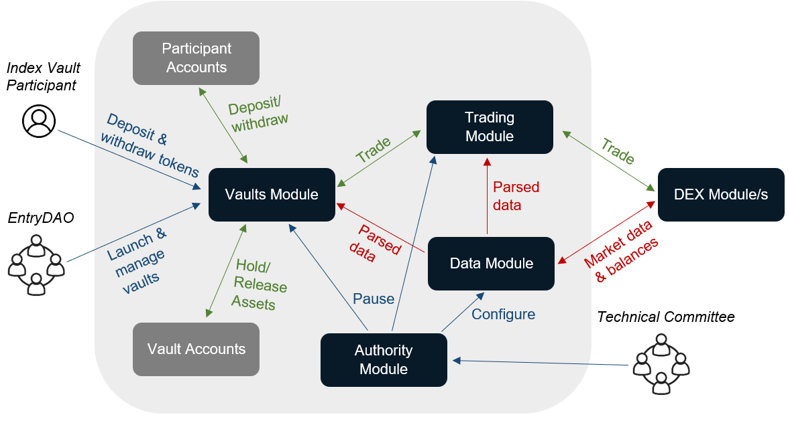
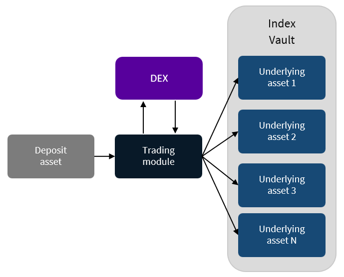
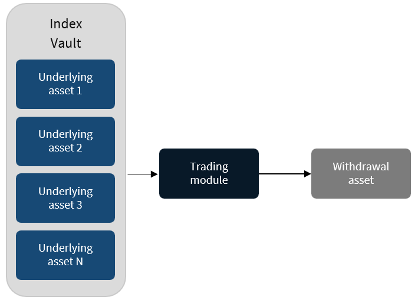
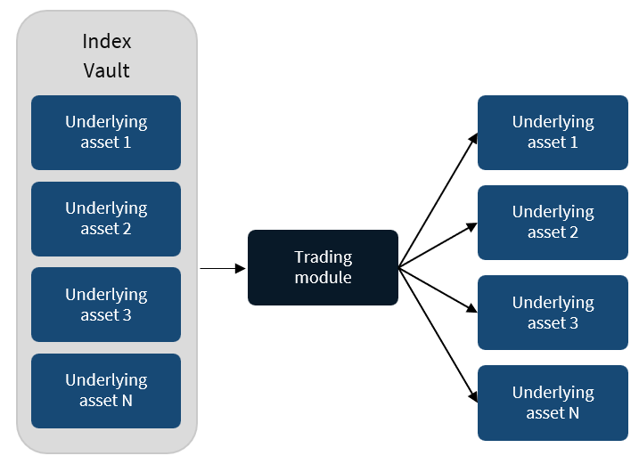
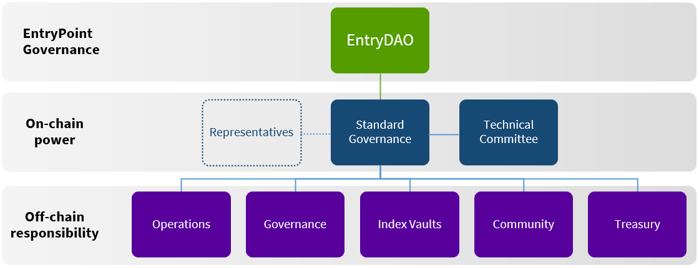

- [1. The Status Quo](#1-the-status-quo)
- [2. EntryPoint](#2-entrypoint)
  - [2.1 Non-Custodial Index Vaults](#21-non-custodial-index-vaults)
  - [2.2 Vault Examples](#22-vaultexamples)
  - [2.3 Fully Collateralised Index Tokens](#23-fully-collateralised-index-tokens)
  - [2.4 Use Cases](#24-use-cases)
  - [2.5 Revenue Model](#25-revenue-model)
- [3. EntryPoint Infrastructure](#3-entrypoint-infrastructure)
  - [3.1 Authority Module](#31-authority-module)
  - [3.2 Data Module](#32-data-module)
  - [3.3 Trading Module](#33-trading-module)
  - [3.4 Vaults Module](#34-vaults-module)
  - [3.5 Securing EntryPoint](#35-securing-entrypoint)
- [4. EntryPoint and the CosmosHub - A Strategic Alliance](#4-entrypoint-and-the-cosmoshub---a-strategic-alliance)
- [5. Governance and Risk Mitigation](#5-governance-and-risk-mitigation)
  - [5.1 Standard Governance](#51-standard-governance)
  - [5.2 Representatives](#52-representatives)
  - [5.3 Technical Committee](#53-technical-committee)
  - [5.4 Index Vaults and Risk Management](#54-index-vaults-and-risk-management)
  - [5.5 Regulatory Strategy](#55-regulatory-strategy)
- [6. Delivery](#6-delivery)

**DISCLAIMER**
*This whitepaper does not constitute investment advice, does not include any promises, offers, guarantees, representations or warranties, and includes speculative forward-looking statements about potential post-launch capabilities of EntryPoint. This whitepaper is qualified in its entirety by the project disclaimers.*

## 1. The Status Quo

The token economy is evolving into a vibrant and interconnected, multi-blockchain ecosystem featuring a wide array of circulating tokens, each with nuanced properties and numerous methods for acquisition. Given the sheer number of tokens available, discerning projects of real value among the plethora of memecoins, “copy-paste projects”, and other high-risk tokens has become increasingly difficult. Navigating this intricate landscape requires both strong technical acumen as well as significant time and effort to analyse and manage a portfolio of tokens; all of which can be overwhelming, even risky, for retail and institutional newcomers alike. 

The crypto industry has slowly woken up to these problems, providing the first set of solutions in the form of crypto indexes. While providing much-needed simplicity, existing index products, whether from centralised or decentralised providers, have serious limitations inherent to their applicability and long-term sustainability. 

With regards to centralised exchanges, there is notable counterparty risk to consider due to the opacity often surrounding their operations and business model, as recently exemplified by the catastrophic FTX bankruptcy. Decentralised index alternatives do exist and are typically referred to as _vaults_. These tend to be more transparent, but usually have significant issues associated with their scalability, gas fees and ability for cross-chain interactions. Most importantly, current vault-providers often lack technical sovereignty and remain bound to a single ecosystem or decentralised exchange (DEX) to conduct their swaps; meaning they are either limited in their ability to offer truly diversified index products that cover multiple ecosystems and strategies, or entirely reliant on the success of a singular third-party DEX. Additionally, current vault strategies tend to focus on yield farming and staking strategies, leaving a significant gap for passive strategies that cater to users seeking lower risk and broader participation.

## 2. EntryPoint

Envision a sovereign blockchain, providing its community with secure, non-custodial access to diversified, passive cross-ecosystem investments in the token economy through a single, liquid asset. Governed as public infrastructure by a decentralised community, such a solution could instead seek to raise professional standards, promote sustainable best practices, and better educate users in risk management. By design, it would reduce counterparty risk and place the platform’s longevity in the hands of the community. Through transparent structures and self-regulating decentralised community governance, said platform could pave the way for trust building and open dialogue with regulators—thus aiding in the maturation of the token economy.  \
	EntryPoint (hereafter EP) is just that. It is a sovereign, fully open-source and permissionless Cosmos SDK blockchain that allows tokens from any IBC-connected blockchain to be collectively assembled and stored in non-custodial **index vaults** allowing users to deposit collateral and access thematic and broad market participation in the tokenised economy through fungible, fully-collateralised **index tokens**. As a public infrastructure platform managed through transparent governance structures, EP helps its users filter out noise, diversify risk and bridge the technical and operational gap of blockchains by leveraging decentralised community governance. This enables EP to provide trust-minimised management and diversification of token portfolios in a cost-efficient and tax-friendly manner, allowing users passive participation without the need for technical expertise and time-consuming active management. 

### 2.1 Non-Custodial Index Vaults

An index vault is a blockchain-based repository that houses tokenised assets in a transparent, non-custodial and fully-collateralised manner. Each vault is home to a unique set of tokens based on a distinct market strategy and methodology, allowing users to access broad exposure to tokenised markets or specific sectors and themes within. They do not require a central authority to allocate assets, rebalance or implement redemptions, thus reducing counterparty risk almost completely. 

###  2.2 Vault Examples

Though there are numerous strategies a vault builder could create, a list of a few examples are considered here: 

* _Total market index:_ An intuitive and comprehensive strategy that aspires to encompass the whole tokenised market, making it an optimal entry point for newcomers and truly passive participants.
* _Macro-ecosystem vaults:_ Strategies that enable broad participation across a single ecosystem. 
* _Thematic vaults:_ Allowing users to easily engage with specific segments of the tokenised economy that they believe in, for example decentralised finance (DeFi) or the Metaverse.
* _Stablecoin vaults:_ Offering risk-averse stablecoin holders an opportunity to diversify their portfolio, reducing dependency on a single stablecoin
* _Liquid staking vaults:_ As the ecosystem matures, innovations enabling liquid staking are emerging. Deploying strategies that leverage these technologies will confer added value to users, as they can partake indirectly in staking across multiple chains via a single application. 
* _Smart Beta vaults:_  Strategies that use alternative index construction rules based on factors such as size, value, quality, momentum, volatility, etc., as opposed to using only rudimentary market capitalisation weights. 

### 2.3 Fully Collateralised Index Tokens

An index token is a representation of one’s share in an underlying index, which users receive when they deposit into an index vault. The quantity received depends on deposit size and real-time market data, as index tokens remain fully collateralised by the assets held in the vault. This allows users to further utilise their vault positions in other DeFi protocols while still benefiting from a broad and diversified token portfolio.

### 2.4 Use Cases

* _Diversification:_ A time-tested concept for essentially any endeavour that involves risk, and remains standard practice in conventional industries. Diversification spreads risk, cushions the impact of market volatility, protects capital, alleviates time spent monitoring portfolios, and if anything, provides a sound long-term plan.

* _Passive portfolio management:_ In addition to the steep initial technical learning curve facing newcomers, the high-paced nature of the evolving token economy is also difficult to keep up with, even for the experienced. By taking a passive approach via EP indexes, users can get broad market exposure while benefiting from the wider expertise and methodical, collective due diligence of the EntryDAO community.

* _Treasury management:_ Native tokens remain highly overrepresented in treasury pools for the large majority of projects (up to 80% as a share of total funds according to Messari), which sets up a single-point dependency that invites both excessive and unnecessary (il)liquidity risk. By participating in index vaults, treasuries can strengthen their overall resilience and be better positioned to capitalise on rising opportunities throughout the cycle.

* _Collateral:_ Index tokens as pristine lending collateral for use within DeFi money markets, innovative price discovery within AMM pools and reduced risk in liquidity provision.

### 2.5 Revenue Model

The on-chain capabilities of blockchain technology affords EP the possibilities to set up direct revenue streams to the community treasury from the index vaults that it collectively owns and manages. This gives the option for various types of participation fees, including streaming fees, entry and exit fees, possibly management and performance-related fees. The exact fee structures for each vault remain at the discretion of the community, and are determined by individual vault characteristics and management requirements, calculated annually and deducted on a block-by-block basis. By not relying on transaction fees for revenue, EP enjoys enhanced autonomy in how it generates and accrues value. A second source may come from maximal extractable value (MEV) that occurs on EP, which may be extracted to the community treasury once there is sufficient on-chain activity on EP. Future partnerships could be another potential option for additional revenue streams, assuming there is alignment and beneficial synergies for EP and its users.

## 3. EntryPoint Infrastructure

EP is developed with the Cosmos Software Development Kit (SDK) v0.47, the latest version of the SDK at the time of writing, and utilises the Inter-Blockchain Communication Protocol (IBC) v7. Designed to mitigate high settlement costs, transaction finality issues and poor scalability, this technology stack offers robust chain security, high performance, low gas costs, and reliable cross-chain communication with native token support to other IBC blockchains, Cosmos SDK based or otherwise. 

The Cosmos SDK further empowers EP with complete technological autonomy, free from the constraints of any specific DEX or layer-1 blockchain. This grants EP improved cross-chain integration possibilities <a href="#note1" id="note1ref">1</a>, lesser dependence on third-party bridges, and reduced associated risk. Being a sovereign chain, EP upholds chain neutrality and aims to support connectivity to multiple DEXes, with greater operational adaptability and control over counterparty risk compared to the restrictions of a single-DEX system. This equips EP to navigate the uncertain and swiftly evolving token economy with flexibility, enabling it to maintain robust product-user alignment and ensure its sustained relevance. In a future with multiple DEXes, EP could serve as an arbitrageur, executing trades optimally across these platforms based on price and liquidity.  

In addition to the modules that are shipped in SDK v0.47 and IBC v7, EP is equipped with four additional bespoke modules. These are:

* Authority
* Data
* Trading
* Vaults

**
Figure 1: EntryPoint’s blockchain infrastructure
**

	

### 3.1 Authority Module

The Authority module facilitates the configuration of the [Technical Committee](#53-technical-committee). By definition the Technical Committee has privileged governance rights over EP that allows it to execute specific functions. Such functions <a href="#note2" id="note2ref">2</a> include: 

* Pausing vaults 
* Pausing specific chain functions, such as trading logic and IBC 
* Implementing whitelisting suggestions from the community
* Configuring price feeds and cancellation of trade orders

### 3.2 Data Module

The Data module has two main functionalities; first, being EP's directory, and secondly, in charge of fetching data from other blockchains and organising it appropriately. At launch, EP will utilise the Strangelove [async-ICQ](https://github.com/strangelove-ventures/async-icq) module to query other Cosmos Chains. In order to conduct an ICQ (Interchain Query), specific parameters are required to tell EP who to interact with and how. To interact with a specific chain, a zone is created which includes IBC parameters as well as those pertaining to Interchain Account (ICA) on a given chain. The creation of a zone is done through an on-chain governance proposal and the subsequent updating of its parameters are done so by the technical committee.

**Directory services**

In order to facilitate the access of thematic index vaults, EP will have to query third party chains to obtain: the latest price feeds, LP IDs and liquidity as well as information associated with an ICA account. Not all datasets will be stored on EP - indeed most will be ephemeral. Pricing data feeds will be stored on EP and will be used to calculate the TWAP (Time Weighted Average Price). All other datasets will be considered ephemeral and will be queried as and when it is needed.

### 3.3 Trading Module

The trading module acts as the smart order router for EP and is where all the trading logic resides. Generally, it receives the state of a current token balance and a target composition, and applies an optimised swap logic to output a new token balance with the new target composition (minus price impact and slippage).

**
Figure 2: EP's Trading Module Mapping Functionality
**

In the event a deposit is placed into an EP index vault, the trading module identifies the deposit denom, size of the deposit as well as the composition of the vault, and then identifies the best method to swap the deposit into the numerous assets as defined by the vault.

**
Figure 3: Trading module, deposit functionality
**

Upon initiation of a redemption, the procedure will first involve the disclosure of all the assets currently held within the vault, alongside the specific asset denomination intended for withdrawal, to the trading module. Subsequently, the trading module will ascertain the most advantageous swap logic to meet this demand. It is important to note that redemptions can be facilitated either through the initially deposited token or via the underlying token composition of the index vault.

**
Figure 4: EP's Trading module redemption functionality. The user is able to redeem their deposit asset.
**

**
Figure 5: EP's Trading module redemption functionality. The user is able to redeem the constituent assets that make up the Vault.
**

The trading module is agnostic to whether a given order is a rebalance, deposit or withdrawal, and only deems a trade order is complete, once the assets return back to EP. Once the swap logic is defined by the trading module, the trading module collaborates closely with the data module to retrieve the relevant zones it requires. Upon the successful completion of the swaps instigated by the trading module, a hook is triggered by the vault which takes custody of the asset.

### 3.4 Vaults Module

Lastly, the vault module manages the index vaults that are available on EP. This includes setting vault attributes such as titles and the vault strategies as well as vault fees (denominated in a vault’s index tokens).\
Strategies will be defined within the vaults module and this will be comprehensive such that compositions and weights are defined. Subsequent rebalances to ensure that the strategy is consistent with the underlying strategy as defined in the vaults module are done via on-chain governance proposals.

### 3.5 Securing EntryPoint

[Proposal 72](https://www.mintscan.io/cosmos/proposals/72)'s vision of integrating consumer chains into the Cosmos Hub, thereby catalysing an interoperable economic zone, forms the basis for EP's forthcoming launch. The intention of EP is to procure Replicated Security services from the Cosmos Hub, pending the approval of its community. Replicated Security, a shared security model, was introduced to the Cosmos Hub following the [Lambda V9 upgrade](https://forum.cosmos.network/t/proposal-187-accepted-v9-lambda-upgrade-with-replicated-security/8766). \
EP has been designed and engineered to be compatible with this Cosmos Hub functionality. No changes have been made to EP’s consensus mechanism nor block production mechanisms, more generally. As EP is engineered using Cosmos SDK V0.47, no additional technical overheads from the Cosmos Hub community should be expected.

## 4. EntryPoint and the CosmosHub - A Strategic Alliance

A partnership with the Cosmos Hub would allow EP to leverage cutting-edge security from a reputable network of Cosmos Validators, and a proactive Cosmos community to help manage EP, develop benchmark indexes and provide the right level of community oversight. As the ATOM Economic Zone (AEZ) vision is realised, EP equally aspires to be an integral partner to the AEZ constituents. Doing so would allow EP to provide the following benefits to AEZ partners:

1. EP's integration with the ATOM Economic Zone will diversify Cosmos Hub's revenue streams, adding to earnings derived from: Neutron (running dApps) , Stride  (LSD products) as well as Duality (DEX) by introducing a fourth, DeFi-derived income stream. 

2. EP aims to provide quality collateral in the form of index tokens for DeFi primitives, such as credit protocols and secondary markets, currently missing within the AEZ and the broader Cosmos ecosystem—potentially boosting productive credit issuance and growth within the Cosmos ecosystem.

3. An intuitive user experience through EP will facilitate the entry of liquidity into the ecosystem. As EP’s Total Value Locked (TVL) grows, so too will ATOM's secured value increase, thus increasing the importance of the Cosmos Hub in the internet of blockchains.

4. Alignment and collaboration between EP and Cosmos' technically competent community could expedite development of tools and infrastructure for a thriving AEZ.

5. As EP implements and evolves its governance structures and the associated technology, the experience will flow upstream to benefit the Hub's coordination efforts as it evolves into the main coordination platform within the Cosmos ecosystem.

6. EP plans to launch Cosmos-centric products like the Cosmos Index Vault, aiming to provide simple user onboarding into the AEZ, foster growth and extend Cosmos' influence across the blockchain industry.

7. As EP seeks regulation, it'll enhance Cosmos Hub's visibility amongst new DeFi and Web3 users, broadening its user base.

## 5. Governance and Risk Mitigation

EP is governed by the EntryDAO, a decentralised autonomous organisation (DAO), using a _one-token-one-vote_ Cosmos SDK system of proposal making and voting that allows holders of the $ENTRY token to make collective decisions over the EP blockchain. EntryDAO leverages a governance model that combines direct democracy with modular DAO governance. It achieves this by utilising semi-autonomous working groups to handle operational day-to-day activities, with the community functioning as a board of directors with oversight on development and supervisory control over working groups. Working groups composed of skilled community members hold purely off-chain responsibilities, with no extra privilege on-chain. This constitutes the first version of EntryPoint governance, but is expected to evolve and adapt over time according to the needs of EP and EntryDAO. At genesis, there will be two main governance groups who hold on-chain power on the EP blockchain: Standard governance and the Technical Committee.

### 5.1 Standard Governance

Token holders can access governance by delegating their $ENTRY tokens to a representative, enabling them to vote on critical on-chain decisions related to EP, including management of the blockchain, treasury, index vaults, committees and working groups, among other things. 

### 5.2 Representatives]

Within standard governance, representatives are active community members who vote on behalf of token holders, by accepting delegated $ENTRY tokens. Representatives are a novel innovation of the Cosmos Hub’s Replicated Security, and serve in place of validators. This affords EP a liquid democratic system with flexible delegation to accommodate token holders unable to vote, while avoiding issues related to centralisation of voting power among validators. In this system, the vote of non-active members will default to their chosen representative's vote, but a token holder's direct vote will always override their representative's vote.

### 5.3 Technical Committee 

Based on the aforementioned Authority Module, the Technical Committee operates as EntryDAO's primary response mechanism during unforeseen circumstances. Entrusted with ensuring the EP protocol's secure and efficient operation, the committee oversees technical development and chain configurations, intervening swiftly when necessary through a _one-address-one-vote_ majority. The on-chain privileges granted to the Technical Committee are meticulously constrained, with the aim of protecting the democratic rights of $ENTRY holders, as outlined in the [EntryDAO constitution](https://docs.google.com/document/d/10IeL_7Kx42gvETHQBRX61U-U-HkO5tfRASvFLSckXKE/edit?usp=sharing). The Committee is under the exclusive jurisdiction of standard governance, which oversees its work and holds the authority to elect or dismiss members in response to the community's requirements. 

**
Figure 6: Hierarchy of the EntryDAO at genesis.
**

To learn more about EP governance, see the [documentation pages.](https://simply-vc.gitbook.io/entrypoint/Buuzzee1DiW6VAlgmYwJ/)

### 5.4 Index Vaults and Risk Management

With the DeFi sector still in its infancy, an acute lack of professional evaluation standards still remains to offset the high-risk high-reward mentality that have characterised the early days of the space. As a result, end-users face a more arbitrary and riskier valuation process. It is crucial to address this challenge, emphasising the pressing need for improved risk management practices and professional procedures in the crypto industry. EP responds to this call, setting up robust and reliable evaluation standards that prioritise user safety. \
	EP’s index vaults are at the forefront of this initiative, adhering to clear, well-established best practices that promote prudent risk management and an informed user base. This involves a rigorous eligibility process to ensure safe provision of high-quality tokens for EP users, with transparent governance documentation on [index vault management](https://docs.google.com/document/d/13GylMBLaoQbcX-q5eekKyU86lo_gQxffjzNiQqtwVlk/edit?usp=sharing) and standardised proposal templates for [token whitelisting](https://docs.google.com/document/d/1VLBQsQ2OVwHR-DwVd1Jh1EyM6CflrtbysxhLYszS6Xc/edit?usp=sharing) and [index vaults](https://docs.google.com/document/d/15uL_ZVnYT8n5NApPRbDcUPgFmAQd8sOXq-54KLjDiC4/edit?usp=sharing) to ensure consistent and streamlined decision-making.  \
	The Index Vault Working Group carries out ongoing monitoring of index vaults and their underlying tokens, and further strives to provide exhaustive and cutting-edge information about each product and the overall portfolio, empowering greater portfolio customisation, and supporting users in making informed decisions around their portfolio. Each index vault comes complete with a comprehensive [risk disclosure documentation](https://docs.google.com/document/d/1p3Q9Bb6A5UczfJTFYmyNR7rhWr9rN78en3bLA-ijHWI/edit?usp=sharing) to enlighten users about potential risks related to market volatility, cybersecurity, liquidity issues, regulation, tax implications, and operations.

### 5.5 Regulatory Strategy

EP utilises a blend of innovative blockchain technology, conventional best practices and professional standards to create a decentralised governance model that underscores transparency, self-regulation and user safety. By emulating key elements of traditional finance in its product offerings and decision-making processes, EP assures an additional layer of integrity and confidence in its operations, with recognisable and easy to navigate structures. 
It is envisioned that such structures will lay the foundation for productive engagement with regulators in a long-term path towards EP becoming a fully licensed and regulated platform, with EP products integrated into existing financial infrastructure. This would facilitate greater institutional as well as broader societal adoption, significantly increasing the likelihood of higher inflows of capital.  
The objective of such a regulatory pursuit, should it be deemed to be desirable by governance, would be to obtain licences for:

* The EntryDAO and its governance to be recognised as a financial service provider.
* Index vaults that are licensed as financial instruments.

## 6. Delivery

**
Figure 7: An outline of the various phases associated with EP's launch.
**

As depicted in the figure above, EP will launch in 3 phases starting Q2 2023.

The first phase will see the launch of the EP testnet, which will be secured by the Cosmos Hub’s Devnet. This will allow the EP community to battletest EP’s security as well as the data and trading module.

The second phase will result in the deployment of the vaults module, the Webapp complete with wallet extension as well as the testnet ENTRY faucet and EP explorer. Remediations resulting from community feedback from phase 1 can also be expected too. 

Finally, the third phase will seek to deploy EP mainnet such that it is secured by the Cosmos Hub and formally joins the Cosmos Economic Zone. Vaults to be deployed around launch are subject to what the community intends to propose and approve. 
	

## References {#references}

<a id="note1" href="#note1ref">[1]</a>  [The Interchain Foundation. (2022, December 13). Expanding the Interchain — taking IBC beyond Cosmos appchains](https://medium.com/the-interchain-foundation/expanding-the-interchain-taking-ibc-beyond-cosmos-appchains-b0f9bebb4405)

<a id="note2" href="#note2ref">[2]</a> A comprehensive list of these special privileges can be found in the EP [docs](https://docs.entrypoint.zone)

